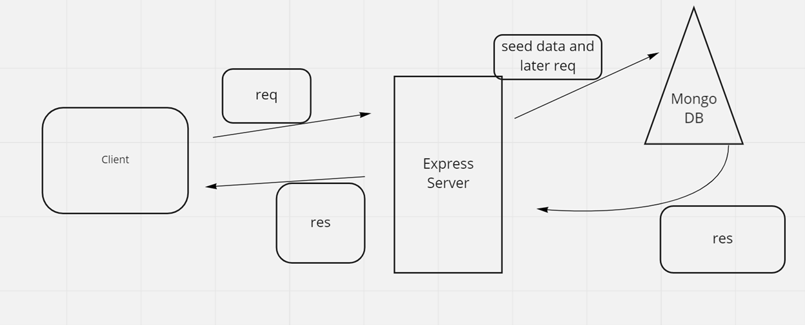

# can-of-books-back-end

**Authors**: Ryan McMillan, Dwight Lindquist, and Michael Maker!
**Version**: 1.0.0 (increment the patch/fix version number if you make more commits past your first submission)

## Overview

Our collective human organization lin-mc-mak shall create a small app to track what books have impacted us, and what’s recommended to read next

<!-- Provide a high level overview of what this application is and why you are building it, beyond the fact that it's an assignment for this class. (i.e. What's your problem domain?) -->

## Getting Started

1. `npm i` on terminal within project repo

2. Encode .env file based on sample.env

<!-- What are the steps that a user must take in order to build this app on their own machine and get it running? -->

## Architecture

<!-- Provide a detailed description of the application design. What technologies (languages, libraries, etc) you're using, and any other relevant design information. -->

## Change Log

<!-- Use this area to document the iterative changes made to your application as each feature is successfully implemented. Use time stamps. Here's an example:

01-01-2001 4:59pm - Application now has a fully-functional express server, with a GET route for the location resource. -->

## Estimates

Name of feature: Book Storage

Estimate of time needed to complete: 3:30

Start time: 15:00

Finish time: ???

Actual time needed to complete: _____

WRRC for today

## Credit and Collaborations

SHEYNA!

<!-- Give credit (and a link) to other people or resources that helped you build this application. -->

---
---
